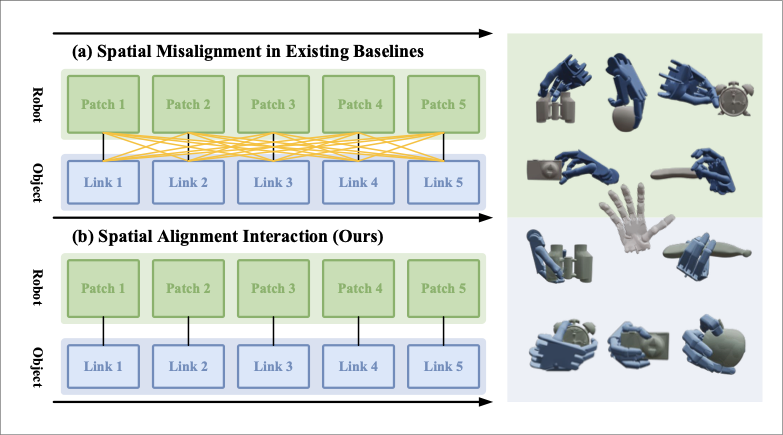
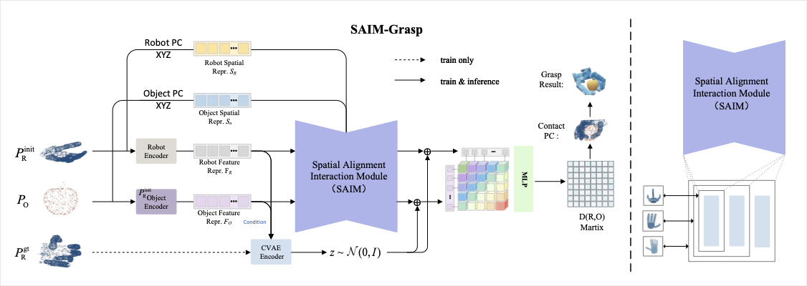
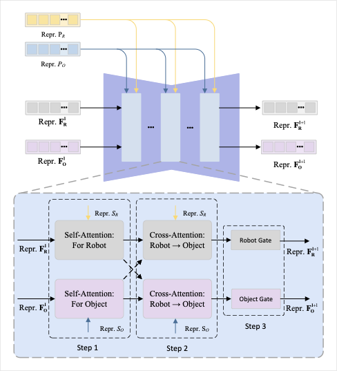
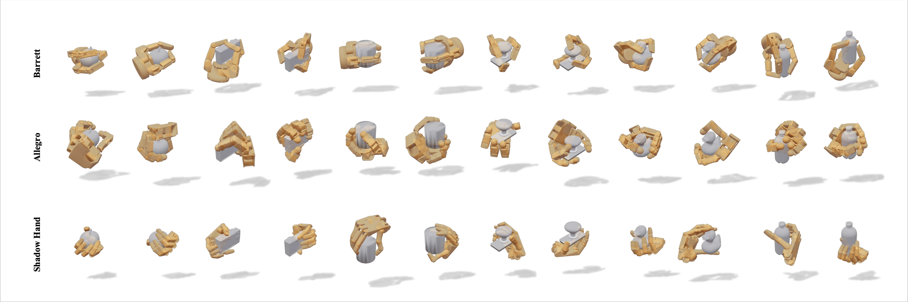

<div align="center">

# SAIM-Grasp: Cross-Embodiment Dexterous Grasping via Spatial Alignment

### [Paper](https://github.com/torloy764/SAIM-Grasp) | [Project Page](https://github.com/torloy764/SAIM-Grasp)

[](https://opensource.org/licenses/MIT)


</div>

---

## 🔥 Overview

<p align="center">
  
  <br>
  <em>Comparison of global (a) and local (b) contact modeling methods for hand--object grasping. Different robotic hands (Barrett Hand, Allegro Hand, Shadow Hand) require distinct contact patterns for the same object.</em>
</p>

**SAIM-Grasp** is a cross-embodiment dexterous grasping framework that reformulates grasp generation from conventional global pose regression into a **progressive spatial alignment process** between local hand and object surface geometries. Our method achieves **91.6% average grasp success rate** across three diverse robotic hands, setting a new state-of-the-art for cross-embodiment dexterous grasping.

### 🎯 Key Contributions

- **Spatial Alignment Interaction Module (SAIM)** — Embeds point-wise 3D relative spatial displacements into the attention mechanism, enabling precise modeling of local contact structures.
- **Adaptive Interaction Depth Mechanism** — Dynamically adjusts the number of interaction layers according to hand complexity (DoF), improving generalization across heterogeneous robotic hands.
- **State-of-the-Art Performance** — Achieves 91.6% average success rate across Barrett Hand, Allegro Hand, and Shadow Hand, with the most significant improvement on high-DoF hands.

---

## 📊 Method Overview

<p align="center">
  
  <br>
  <em>Overall pipeline of SAIM-Grasp. Given a robotic hand description and an object point cloud, the model predicts a grasp pose while preserving physically plausible local contact relationships.</em>
</p>

### Architecture

The framework consists of four key components:

1. **Dual-Branch DGCNN Encoders** — Extract geometric features from robotic hand and object point clouds.
2. **Spatial Alignment Interaction Module (SAIM)** — Iteratively refines local contact correspondences via:
   - *Local Geometric Modeling*: Self-attention enhanced with 3D positional encoding
   - *Hand–Object Geometric Alignment*: Bidirectional cross-attention with geometric attention biases
   - *Morphology-aware Gating*: Adaptive feature weighting according to hand structure
3. **Contact Distance Matrix Prediction** — CVAE-based multimodal grasp distribution modeling with dense point-wise distance prediction.
4. **Kinematic Optimization** — Reconstructs 6D pose and joint configuration from the predicted distance matrix.

<p align="center">
  
  <br>
  <em>Architecture of the Spatial Alignment Interaction Module (SAIM). Each layer contains Local Geometric Modeling, Hand–Object Geometric Alignment via bidirectional cross-attention with geometric displacement encoding, and Morphology-aware Gating.</em>
</p>

---

## 📈 Experimental Results

### Main Results

<table align="center">
<tr>
  <th rowspan="2">Method</th>
  <th colspan="4">Success Rate (%)</th>
  <th colspan="4">Diversity (rad.)</th>
</tr>
<tr>
  <th>Barrett</th> <th>Allegro</th> <th>Shadow</th> <th>Avg.</th>
  <th>Barrett</th> <th>Allegro</th> <th>Shadow</th> <th>Avg.</th>
</tr>
<tr>
  <td>DFC (2021)</td>
  <td>86.3</td> <td>76.2</td> <td>58.8</td> <td>73.8</td>
  <td>0.532</td> <td>0.454</td> <td>0.435</td> <td>0.474</td>
</tr>
<tr>
  <td>GenDexGrasp (2023)</td>
  <td>67.0</td> <td>51.0</td> <td>54.2</td> <td>57.4</td>
  <td>0.488</td> <td>0.389</td> <td>0.318</td> <td>0.398</td>
</tr>
<tr>
  <td>GeoMatch (2023)</td>
  <td>60.0</td> <td>—</td> <td>67.5</td> <td>63.8</td>
  <td>0.259</td> <td>—</td> <td>0.235</td> <td>0.247</td>
</tr>
<tr>
  <td>GeoMatch++ (2024)</td>
  <td>77.5</td> <td>—</td> <td>70.0</td> <td>73.8</td>
  <td>0.378</td> <td>—</td> <td>0.184</td> <td>0.281</td>
</tr>
<tr>
  <td>D(R,O)-Grasp (2024)</td>
  <td>87.3</td> <td>92.3</td> <td>83.0</td> <td>87.5</td>
  <td>0.513</td> <td>0.397</td> <td><b>0.441</b></td> <td>0.450</td>
</tr>
<tr>
  <td>CEDex (2025)</td>
  <td><b>93.1</b></td> <td>88.1</td> <td>85.0</td> <td>88.7</td>
  <td><b>0.624</b></td> <td><b>0.473</b></td> <td>0.438</td> <td><b>0.512</b></td>
</tr>
<tr style="background: #e8f4fd;">
  <td><b>SAIM-Grasp (Ours)</b></td>
  <td><b>89.5</b></td> <td><b>94.4</b></td> <td><b>91.0</b></td> <td><b>91.6</b></td>
  <td>0.458</td> <td>0.379</td> <td>0.364</td> <td>0.400</td>
</tr>
</table>

> **SAIM-Grasp achieves the highest average success rate (91.6%) across all three robotic hands, with the most significant improvement on the high-DoF Shadow Hand (+6.0% over the previous best).**

### Grasp Visualization

<p align="center">
  
  <br>
  <em>Diverse grasp poses generated by SAIM-Grasp on different test objects. The method produces multiple physically coherent grasp configurations with appropriate spatial distributions.</em>
</p>

### Ablation Studies

#### Effect of Spatial Geometric Encoding

| Variant | Barrett | Allegro | Shadow | Avg. |
|:--------|:-------:|:-------:|:------:|:----:|
| w/o Vector | 90.7 | 94.8 | 85.8 | 90.4 |
| Scalar-only | 89.3 | 95.2 | 85.6 | 90.0 |
| **Ours (3D Vector)** | **91.7** | **96.4** | **83.4** | **90.5** |

#### Interaction Depth vs. Kinematic Complexity

| Layers $L$ | Barrett | Allegro | Shadow |
|:----------:|:-------:|:-------:|:------:|
| $L=0$ | **92.7** | 81.0 | 53.3 |
| $L=1$ | 90.8 | **96.1** | 88.5 |
| $L=2$ | 90.1 | 94.8 | 85.4 |
| $L=3$ | 89.5 | 94.4 | **91.0** |

> Low-DoF hands (Barrett) benefit from shallower interaction, while high-DoF hands (Shadow) require deeper refinement — validating the adaptive interaction depth design.

### Cross-Hand Generalization & Robustness

| Setting | Barrett | Allegro | Shadow |
|:--------|:-------:|:-------:|:------:|
| Single-Hand Training | 90.17 | 95.58 | 85.67 |
| Multi-Hand Training | 89.50 | 94.40 | **91.10** |
| Partial Occlusion (50%) | 89.80 | 94.70 | 83.40 |

> SAIM-Grasp demonstrates strong zero-shot transfer and maintains reliable performance under partial point cloud observations.

---

## 🛠️ Installation

```bash
# Clone the repository
git clone https://github.com/torloy764/SAIM-Grasp.git
cd SAIM-Grasp

# Set up environment (conda)
conda create -n saim_grasp python=3.8
conda activate saim_grasp

# Install dependencies
pip install torch torchvision torchaudio
pip install -r requirements.txt
```

### Dependencies

- Python 3.8+
- PyTorch 2.0+
- Isaac Gym (for simulation & evaluation)
- CUDA 11.8+ (recommended)

> **Note:** Full source code and pretrained models will be released upon paper acceptance.

---

## 📖 Citation

If you find this work useful for your research, please cite:

```bibtex
@article{wu2025saimgrasp,
  title={SAIM-Grasp: Cross-Embodiment Dexterous Grasping via Spatial Alignment},
  author={Wu, Di and Tan, Jeffrey Too Chuan and Tian, Ye and Zhu, Jiabing and Yang, Yang and Liu, Xiaoli},
  journal={arXiv preprint},
  year={2025}
}
```

---

## 📄 License

This project is licensed under the MIT License - see the [LICENSE](LICENSE) file for details.

---

<div align="center">
  <b>SAIM-Grasp</b> — Built with ❤️ by researchers at University of Jinan, Inspur Software Group, and Shandong Wise AI Technology.
</div>
